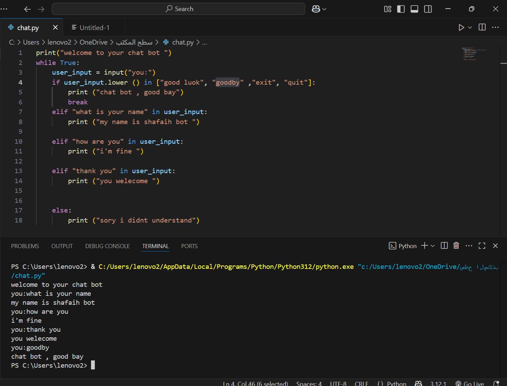

# Simple Chatbot in Python

This is a simple command-line chatbot built using Python.  
It responds to specific predefined phrases and runs in a continuous loop until the user types a quit command.

## Features

- Greets the user at startup  
- Responds to the following inputs:
  - "what is your name"
  - "how are you"
  - "thank you"
- Ends the conversation when the user enters:
  - "good luck", "goodbye", "exit", "quit"
- Prints a default response if the input is not recognized

## Project Files

- : Contains the chatbot source code

## Screenshot

